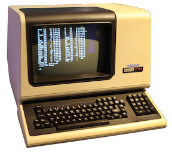

# stv (pronounced _"Steve"_)



`stv` is a **S**tate **T**able **V**iewer for [pfSense](https://github.com/pfsense/pfsense/). It's meant to be used at the commandline (console or ssh). **stv** leverages `pfctl` and `awk` to generate its output.

## Why

[Troubleshooting firewall rules](https://docs.netgate.com/pfsense/en/latest/troubleshooting/firewall.html) can be tricky. There are some good tools included to help, like pfTop, trafshow, iftop, tcpdump and others.

Still, I found myself struggling to get the output I wanted: a list of states where everything was reasonably structured, and every state occupied just a single line (so it can be further piped to grep, awk etc)

**stv** achieves this.

## Installing stv

1. connect to your pfSense instance using ssh or via the console.
2. select option **8**.
3. paste the commands below to download **stv** and prepare it for execution:
```
mkdir /root/bin
fetch -o /root/bin/stv https://github.com/luckman212/stv/releases/download/1.0.0/stv
chmod +x /root/bin/stv
rehash
```

## Using stv

Using **stv** is easy. Just drop to a shell and type:
```shell
stv
```
You should see a list of states, with the following columns of information:

- protocol (`tcp, udp, icmp`...)
- direction (in/out)
- interface that the state was generated on
- rule id associated with the state
- state/creator ID (can be used to uniquely identify, and thus kill, a state)
- state description (`ESTABLISHED`, `FIN_WAIT` etc)
- "talkers" - a term I made up to represent the hosts involved
- gateway (only shown if it's not the default)

> **stv** works best on a wide (>170 columns or more) terminal.

## Filtering

**stv** accepts a single optional parameter which can be used to filter the results to those matching a particular interface, rule ID, state type, IP address etc. The argument is a regex (regular expression).

Pad the search string with `#`'s to make it explicit, otherwise it will be treated as a substring match.

### Examples

- `stv #267#` to output states associated with rule 267 (try `pfctl -vvsr` to obtain the internal pf ruleIDs)
- `stv ESTAB` to only print active states
- `stv #igc[0-2]#` to show states related to igc0, igc1 and igc2

Since all output is standardized and each state is printed on a single line, output from **stv** is well-suited to piping into other tools such as grep or awk.

**stv** will print the total number of matching states at the bottom of the output.

## Continuous Monitoring

To have a "live" updating display, you can use `cmdwatch` (recommended) or a simple shell loop.

### cmdwatch method

step 1
```shell
pkg add https://pkg.freebsd.org/FreeBSD:12:amd64/latest/All/cmdwatch-0.2.0_2.txz
```

step 2
```shell
cmdwatch 'stv #5201#'
```

### shell loop method

```
while :; do clear; stv '#5201#'; sleep 2; done
```
