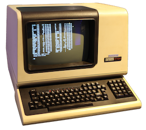
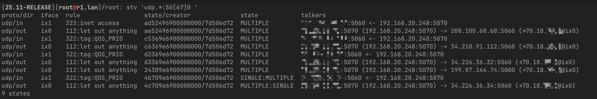

# stv (pronounced _"Steve"_)



⚠️ `stv` 1.3 has been rewritten to handle the new output format of `pfctl` bundled with pfSense version 2.9/25.11. Anyone running an older version should continue to use version [1.2.0](https://github.com/luckman212/stv/releases/tag/1.2.0).

## What

`stv` is a **S**tate **T**able **V**iewer for [pfSense](https://github.com/pfsense/pfsense/). It's meant to be used at the commandline (console or ssh). **stv** leverages `pfctl` and `awk` to generate its output.

## Why

[Troubleshooting firewall rules](https://docs.netgate.com/pfsense/en/latest/troubleshooting/firewall.html) can be tricky. There are some good tools included to help, like pfTop, trafshow, iftop, tcpdump and others.

Still, I found myself struggling to get the output I wanted: a list of states where everything was reasonably structured, and every state occupied just a single line (so it can be further piped to grep, awk etc)

**stv** achieves this.

## Installing stv

1. connect to your pfSense instance using ssh or via the console.
2. select option **8**.
3. paste the commands below to download **stv** and prepare it for execution:
```
mkdir -p /root/bin
fetch -o /root/bin/stv https://github.com/luckman212/stv/releases/download/1.3.0/stv
chmod +x /root/bin/stv
rehash
```

## Using stv

Using **stv** is easy. Just drop to a shell and type:
```shell
stv
```
You should see a list of states, with the following columns of information:

- protocol (`tcp, udp, icmp`...)
- direction (in/out)
- interface that the state was generated on
- rule associated with the state (id & first few words of description)
- state/creator ID (uniquely identifies a state—you can then kill it with `pfctl -k id -k <id>`)
- state description (`ESTABLISHED`, `FIN_WAIT` etc)
- "talkers" - the IPs, ports, and hosts involved

> **stv** works best on a wide (>170 columns or more) terminal.

## Getting Full Rule Descriptions from IDs

**stv** has a built in helper function to search your pf-generated ruleset and output some details of any matching rules. This can help identify what rule is triggering a state when debugging.

Use `stv --rule <query>` to use this function. You can specify the following as a query string:

- an **integer** to match a specific rule by number (or long pf ruleid)
- an **interface** name e.g. `ix1`
- an **action**: `block`, `pass`, `match`
- a **port** name or number e.g. `http` or `8080`
- a **protocol** e.g. `v6` or `udp`
- `quick` or `allow-opts` to find rules with those options enabled
- a **regex** to match the description e.g. `traefik` or `allow.*(traefik|icmp)`

Examples:
```text
# stv --rule 288
rule num    : 288
rule id     : 1763924300
interface   : LANS
action      : block (quick)
proto       : v6/udp
port        : domain-s
description : Block DoH/DoT
```
Here's the "source" of that rule, directly from pfctl:
```text
# pfctl -vvsr | grep @288
@288 block drop in log quick on LANS inet6 proto udp from any to <h_anycast_DNS_servers:19> port = domain-s label "id=1763924300" label "tags=user_rule" label "descr=Block DoH/DoT" ridentifier 1763924300
```

## Filtering

**stv** accepts an optional parameter which can be used to filter the results to those matching a particular interface, rule ID/description, state type, IP address etc. The argument is a regex (regular expression).

### Tips

- run `stv -h` for usage help
- Pad the search string with `%`'s to make it explicit, otherwise it will be treated as a substring match.
- When entering expressions with special characters like `[]` or `.*` enclose them in single quotes to avoid shell interpretation.
- To search for a literal `[` or `]`, use `\\[` and `\\]`

### Examples

- `stv '%267%'` to output states associated with rule 267 (try `pfctl -vvsr` to list all rules along with the internal pf ruleIDs)
- `stv ESTAB` to only print active (established) states
- `stv ':4443 '` port 4443
- `stv '%igc[0-2]%'` show states related to interfaces igc0, igc1 and igc2

Since all output is standardized and each state is printed on a single line, output from **stv** is well-suited to piping into other tools such as grep or awk.

**stv** will print the total number of matching states at the bottom of the output.

Here's a sample screenshot showing states matching `udp` ports `5060` or `5070`:



## Continuous Monitoring

To have a "live" updating display, you can use `cmdwatch`. This is the recommended method.

1. install
```shell
pkg add -f https://pkg.freebsd.org/FreeBSD:16:amd64/latest/All/cmdwatch-0.2.0_3.pkg
```

2. run
```shell
cmdwatch --interval=2 stv 'udp.*:50[67]0 '
```

If you prefer not to install any additional packages, you can use a simple shell loop instead:
```shell
while :; do clear; stv '%icmp.*tun_wg1%'; sleep 2; done
```

Press <kbd>⌃ctrl+c</kbd> to stop the loop.
